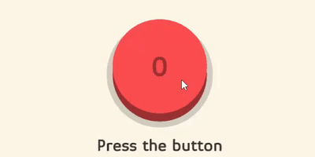
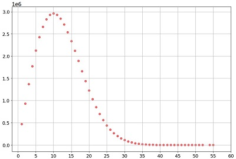

# Obliterate-The-Button
A stupid script to get the world record on a stupid game.

<p align="center">
  
</p>

The game is simple:
- Every time you press the button you get 1 point.
- Every time you press the button your chances to lose all your points is incremented (it goes from 0% to 1%, 2%, 3% etc. after each successful click).

Inspired from [here](https://elendow.itch.io/the-button), discovered in [this video](https://www.youtube.com/shorts/DTG5HIxR9H8).

This project is simple: we run billion of tries in parallel to beat the WR.

## Current World record

<b>I achieved 65</b> (which is likely to be the current world record) after ~ 1 trillion (one thousand billion) tries. I ran the code on my 2080 ti, doing ~1 billion tries every 5 seconds (~12 billion tries per minute).

I also tried on a TPU V3 but it was slower.

Here is an illustration of the distribution of scores over millions of tries:
<p align="center">
  
</p>

## Usage

You'll need [jax](https://github.com/google/jax) and ideally the GPU enabled version.

You can modify the parameters of the script, as the number of tries that are done in parallel at each iteration or the printing frequency.

Current parameters should be OK for average configurations but you can drastically speed up the process by increasing them if your hardware supports it.

```sh
python run.py
```
## Meta

Valentin Macé – [LinkedIn](https://www.linkedin.com/in/valentin-mac%C3%A9-310683165/) – [Twitter](https://twitter.com/ValentinMace) - valentin.mace@kedgebs.com
